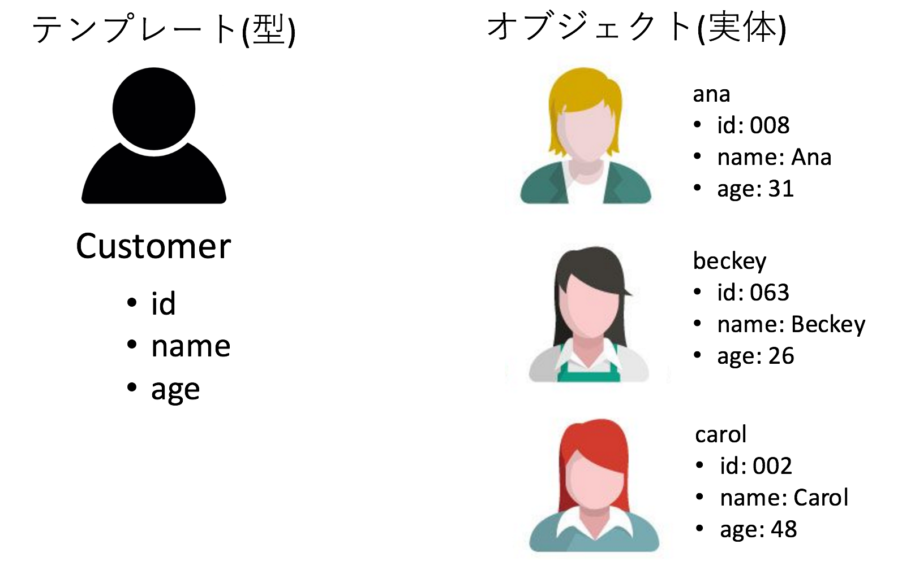
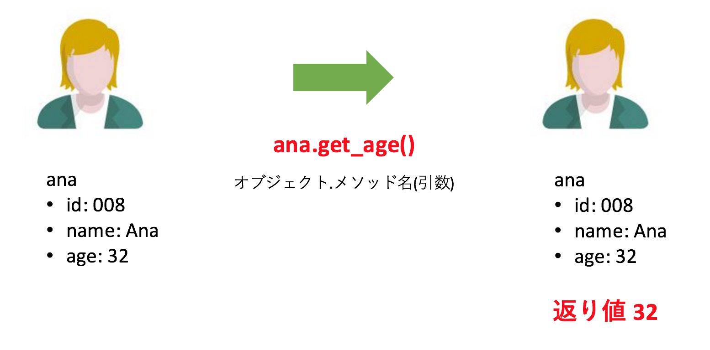
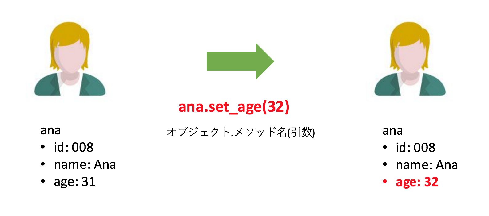
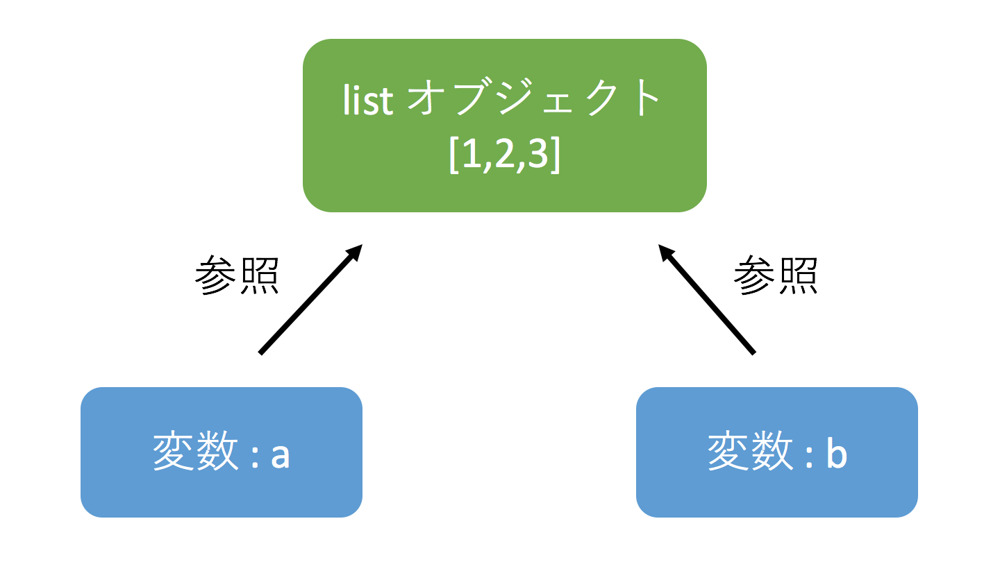

## オブジェクトとメソッド

今まで型や変数、制御構造や関数といったテーマを扱ってきました。
これらは昔から続く「手続き型言語」において重要な概念です。
ただ、昨今のプログラミング言語は「手続き型言語」の進化系ともいえる「オブジェクト指向型言語」
と呼ばれるジャンルに属していることがほとんどです。
もちろん Python もオブジェクト指向型言語です。
この「オブジェクト指向」については話すことが山ほどあるため、本書の続編でメインに扱います。
ただ、これを全く理解していないと本書(上編)の後半が理解しにくくなるため、
少し背伸びをしてその概念の説明をしたいと思います。

まず「オブジェクト指向」における「オブジェクト」なのですが、
これは簡単に言ってしまうと「データの塊 + α」です。
例えばお客様の情報を扱うとしましょう。
ここではお客様ID、名前、年齢を管理しているとします。
オブジェクトはここでは「具体的な顧客情報」にあたり、
それはテンプレートのような枠組み(型)から作成されます。



上記の図でいえば、まずCustomer という一般的な「型」があり、
ana, beckey, carol はその型の具体的なデータ、つまりオブジェクトだといえます。
ana のID、名前、年齢はあくまで ana のものなので、
それぞれ個別にではなく「Customerという単位」でまとめて扱ったほうが簡単です。
beckey、carol についても同じです。
なお、上記のオブジェクトはインスタンスと呼ばれることもあり、
id や name といったオブジェクトに付随するデータはインスタンス変数と呼ばれています。

そしてオブジェクト指向の「データの塊 + α」のαの部分ですが、
それはメソッドと呼ばれる「オブジェクトのデータを操作する処理」 となります。
つまりオブジェクトは「データの塊 + 処理」といえます。

たとえば ana の登録された年齢を変更したいとしましょう。
この時、ana という「オブジェクトに対してメソッド set_age を呼び出す」ことで ana の年齢を変更します。



図にかかれているように「オブジェクト.メソッド名(引数)」とすることでそのオブジェクトを操作することができます。
この set_age というメソッドは ana の年齢を変更するということが明白です。

ちなみに、オブジェクトのメソッドはなにもオブジェクトを変更するだけではなく、
そのデータを「参照する」ためにも使われます。
例えば「年齢を確認する」こと自体はオブジェクト自体には影響は与えません。



参考までに ana オブジェクトの操作イメージを以下にコードで示してみます。
(実際には、私が Customer というクラスを作成してそのデータやメソッドなども定義し、
そこから ana を作成しています。ただ、作成は難しいので省略しています。
あくまでも利用イメージだけに着目してください。)

```
# 現在のオブジェクトの状態をダンプ
>>> ana.dump()
id:   8
name: Ana
age:  31

# ana オブジェクトのメソッドを呼び出し年齢を更新
>>> ana.set_age(32)
# オブジェクトの中身が更新されている
>>> ana.dump()
id:   8
name: Ana
age:  32

# ana オブジェクトから値を取り出す(変更はなし)
>>> ana.get_age()
32
>>> ana.dump()
id:   8
name: Ana
age:  32
```

今回は例に ana を使いましたが、同様の操作は beckey 及び carol に対して行うこともできます。
これらのオブジェクトはどれも Customer という型から作成されたものであり、
同じ型から作られたオブジェクトには同じ操作ができるからです。

本章以降ではこのオブジェクトとメソッドが利用されますが、
基本的には「オブジェクトはデータを内部に持つ」ことと
「メソッドはオブジェクトを操作(中身を変更)もしくは参照(取り出すだけで変更しない)」するということを意識してもらえば、
使っているうちに慣れてくると思います。
なお、Python のデータは実は全てオブジェクトです。
数字もオブジェクトであるため、実はメソッドを呼び出すこともできます。
あえてそのような使い方はされませんが、全てはオブジェクトであるということは覚えておいて下さい。

### オブジェクトの参照

オブジェクトはメモリ上に存在し、オブジェクトが代入された変数はそれを参照しています。
言葉で書くと難しいですが、コードで見ると簡単です。

```python
a = [1,2,3]
b = a
```

上記コードではまず、リストのオブジェクトである[1,2,3] が存在し、それが変数 a に代入されています。
そして変数 a は変数 b に代入されています。
この操作をすると以下の様な状態になっています。



図を見るとわかりますが、変数 a, b は共に同一のリストのオブジェクトを持っているといえます。
そのため、変数 a に対して操作をすると、それは変数 b にも影響を与えます。

```python
a = [1,2,3]
b = a

a.append(4)
print('a: ' + str(a))
# a: [1, 2, 3, 4]

print('b: ' + str(b))
# b: [1, 2, 3, 4]
```

リストのオブジェクトに対して append メソッドを呼び出すと、リストの末尾に要素を追加することができます。
append したあとの print 出力を見ると変数 a に格納されているリストオブジェクトのデータがアップデートされています。
そして変数b に格納されているリストオブジェクトは変数a のものと同じなので、
変数b自体に対しては操作をしていないのに中身が変わっていることがわかります。

変数に対する操作は変数が格納しているオブジェクトに対する操作だといえます。
その変数にどのオブジェクトが入っているかは常に意識するようにしてください。
自分が意図していないところでオブジェクトが操作されてしまっていて、
使うときに問題がおきるというのはよくあるトラブルです。

### オブジェクトの属性の確認

先ほどの ana オブジェクトには name, age といったインスタンス変数や get_age() といったメソッドが存在しましたが、
これらはオブジェクトが持つ「属性」と呼ばれるものです。
この属性としてどのようなものがあるかは dir 関数を使うことで確認できます。
dir 関数の引数としてオブジェクトを与えると、属性の一覧をリスト形式で返してくれます。
たとえば文字列型の属性であれば以下のようになります。

```
>>> dir('text')
['__add__', '__class__', '__contains__', '__delattr__', '__dir__', '__doc__',
 '__eq__', '__format__', '__ge__', '__getattribute__', '__getitem__',
 '__getnewargs__', '__gt__', '__hash__', '__init__', '__iter__', '__le__',
 '__len__', '__lt__', '__mod__', '__mul__', '__ne__', '__new__', '__reduce__',
  '__reduce_ex__', '__repr__', '__rmod__', '__rmul__', '__setattr__',
  '__sizeof__', '__str__', '__subclasshook__', 'capitalize', 'casefold',
  'center', 'count', 'encode', 'endswith', 'expandtabs', 'find', 'format',
  'format_map', 'index', 'isalnum', 'isalpha', 'isdecimal', 'isdigit',
  'isidentifier', 'islower', 'isnumeric', 'isprintable', 'isspace', 'istitle',
  'isupper', 'join', 'ljust', 'lower', 'lstrip', 'maketrans', 'partition',
  'replace', 'rfind', 'rindex', 'rjust', 'rpartition', 'rsplit', 'rstrip',
  'split', 'splitlines', 'startswith', 'strip', 'swapcase', 'title',
  'translate', 'upper', 'zfill']
```

オブジェクトのメソッド名を忘れてしまった際などに dir 関数を使ってどういうものがあるか確認できます。ぜひ活用してみてください。
